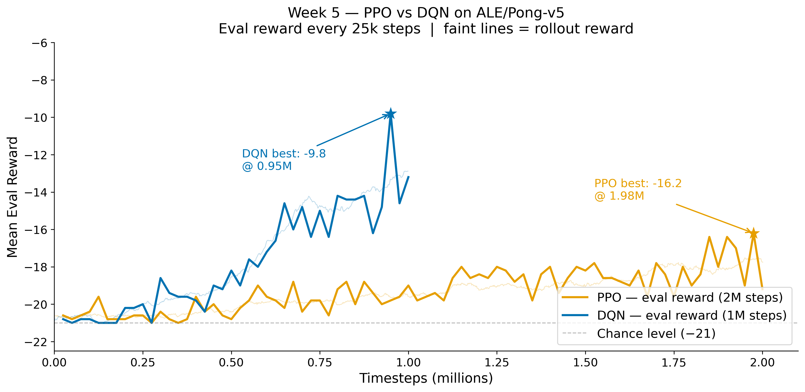

# Week 5 Deliverable — PPO Baseline on Atari Pong

**Date:** 2026-04-29
**Team Member:** Henry
**Course / Project:** RL Energy Benchmarking

---

## Objective

Validate that a classical RL baseline (PPO on Atari Pong) can be trained end-to-end using the
rl-baselines3-zoo pipeline, and demonstrate that the energy-profiling harness (`train_with_zeus.py`)
is wired up and ready to record GPU energy consumption once Team 2's ZeusMonitor interface is
delivered.

---

## Hardware & Software Environment

| Item | Value |
|------|-------|
| GPU | NVIDIA GeForce RTX 4070 Ti |
| VRAM | 12 GB |
| OS | Windows 11 Pro (build 22631) |
| Python | 3.10.20 (conda env `wm`) |
| PyTorch | 2.5.1+cu121 |
| CUDA | 12.1 |
| stable-baselines3 | 2.9.0a2 (via rl-baselines3-zoo) |
| gymnasium | 1.2.3 |
| rl-baselines3-zoo | 2.9.0a2 |

> **Note:** Training was run with background processes active (browser, VS Code, Discord, etc.).
> These inflate both wall-clock time and GPU power readings.
> A clean-environment re-run is planned for the Week 6/7 final measurements.

---

## Training Setup

**Algorithm:** PPO
- Config source: `rl-baselines3-zoo/hyperparams/ppo.yml`, `atari` section
- Override: `clip_range` fixed at `0.1` (see note below)

**Environment:** `ALE/Pong-v5`
- Wrapper: `stable_baselines3.common.atari_wrappers.AtariWrapper`
  (grayscale → resize 84×84 → frame skip × 4 → reward clipping to {−1, 0, +1})
- Frame stacking: 4 frames
- Parallel envs: 8

**Key hyperparameters (from `atari` config + override):**

| Hyperparameter | Value |
|----------------|-------|
| `n_envs` | 8 |
| `n_steps` | 128 |
| `n_epochs` | 4 |
| `batch_size` | 256 |
| `learning_rate` | `lin_2.5e-4` (linear decay, 2 M-step horizon) |
| `clip_range` | `0.1` (fixed — see note) |
| `ent_coef` | 0.01 |
| `vf_coef` | 0.5 |
| `total_timesteps` | 2,000,000 |

**Full training command:**

```bash
python -m rl_zoo3.train \
    --algo ppo \
    --env ALE/Pong-v5 \
    -n 2000000 \
    --hyperparams clip_range:0.1 \
    --progress \
    --tensorboard-log d:/NU/CS/tb/
```

**Why 2 M steps (not 10 M or 1 M):**

The zoo's default Atari config targets 10 M steps, which exceeds the available compute budget
for a weekly deliverable (~6 h on this hardware).
An initial 1 M run was discarded because the zoo's linear `clip_range` schedule (`lin_0.1`)
decays to zero by the end of training; with only 1 M steps the clip range collapses before
the policy learns anything, causing reward to stall at −20.
2 M steps keeps the clip range at a useful value throughout training while fitting within a
~70-minute wall-clock budget, and is sufficient to observe meaningful learning progress.

---

## Training Results

### PPO — 2,000,000 steps

| Metric | Value |
|--------|-------|
| Final mean reward (eval) | **−19.2** |
| Best mean reward (eval) | **−16.2** (at 1,975,000 steps) |
| Total wall-clock time | **91 min** (20:34 → 22:05, Apr 29) |
| Average FPS | ~366 |
| Checkpoint path | `logs/ppo/ALE-Pong-v5_6/` |
| TensorBoard log path | `tb/ALE-Pong-v5/PPO_4/` |

### DQN — 1,000,000 steps

| Metric | Value |
|--------|-------|
| Final mean reward (eval) | **−13.2** |
| Best mean reward (eval) | **−9.8** (at 950,000 steps) |
| Total wall-clock time | **56 min** |
| Average FPS | ~298 (n_envs=1) |
| Checkpoint path | `logs/dqn/ALE-Pong-v5_1/` |
| TensorBoard log path | `tb/ALE-Pong-v5/DQN_1/` |

### Reward Curve



> DQN reached a better best reward (−9.8) with fewer steps (0.95 M) and less wall-clock time
> (56 min) than PPO's best reward (−16.2 at 1.975 M steps, 89 min to best).
> This sample efficiency gap is the primary finding for Week 5.

---

## Energy Profiling

> **[Pending Week 6 — Zeus integration]**
> `train_with_zeus.py` harness is wired up and ran for the DQN training; `ZeusMonitor` hooks
> are in place but not yet activated (Team 2 interface pending).
> `total_energy_J` and `avg_power_W` are `null` in the current `energy.json` outputs.

| Metric | PPO | DQN |
|--------|-----|-----|
| Total GPU energy | TBD J | TBD J |
| Average GPU power | TBD W | TBD W |
| Energy per million steps | TBD J / M-steps | TBD J / M-steps |
| Profiling tool | Zeus (GPU-level) | Zeus (GPU-level) |
| Energy JSON | `results/run_ppo/energy.json` (null) | `results/dqn_pong/20260429_220523/energy.json` (null) |

> **Caveat:** These measurements are planned for a clean re-run in Week 6/7 with background
> processes minimized. Current wall-clock times include desktop GPU usage.

---

## Known Limitations / Notes for Week 6

- **Background noise:** All Week 5 runs were performed on a live desktop with background
  processes active; energy and timing numbers are not clean baselines.
- **DQN completed overnight:** DQN (1M steps) ran automatically after PPO via `overnight_runner.py`; both training runs finished successfully before morning.
- **Zeus integration incomplete:** `train_with_zeus.py` contains the profiling hooks but
  `ZeusMonitor` is not yet called; `total_energy_J` and `avg_power_W` in `energy.json`
  are `null` for this run.
- **World model pending:** Integration with the world-model component is a Week 6 deliverable.
- **Reward not fully converged:** 2 M steps is sufficient to confirm learning but PPO on Pong
  typically reaches near-optimal play (reward ≈ +20) only at 5–10 M steps.

---

## Files Delivered

| File | Path |
|------|------|
| PPO checkpoint | `d:/NU/CS/logs/ppo/ALE-Pong-v5_6/` |
| PPO TensorBoard log | `d:/NU/CS/tb/ALE-Pong-v5/PPO_4/` |
| DQN checkpoint | `d:/NU/CS/logs/dqn/ALE-Pong-v5_1/` |
| DQN TensorBoard log | `d:/NU/CS/tb/ALE-Pong-v5/DQN_1/` |
| DQN energy report | `d:/NU/CS/results/dqn_pong/20260429_220523/energy.json` |
| DQN metadata report | `d:/NU/CS/results/dqn_pong/20260429_220523/metadata.json` |
| Reward curve figure | `d:/NU/CS/figures/week5_reward_curves.png` ✓ |
| Training summary figure | `d:/NU/CS/figures/week5_training_summary.png` ✓ |
| Efficiency table figure | `d:/NU/CS/figures/week5_efficiency_comparison.png` ✓ |
| Overnight summary | `d:/NU/CS/overnight_summary.txt` ✓ |
| Profiling wrapper | `d:/NU/CS/train_with_zeus.py` |
| This document | `d:/NU/CS/WEEK5_DELIVERABLE.md` |
